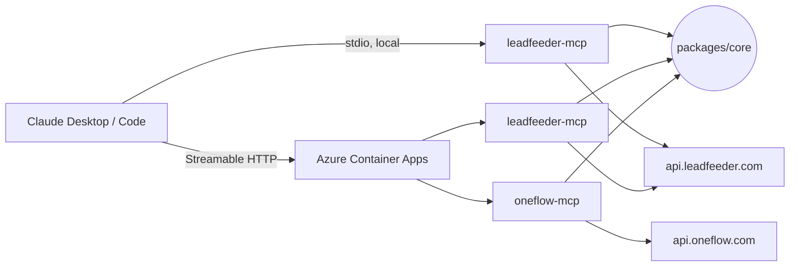

# mcp-servers

TypeScript monorepo of Model Context Protocol servers wrapping SaaS APIs, usable from Claude Desktop / Claude Code both locally (stdio) and remotely (Streamable HTTP on Azure Container Apps).

- [`packages/core`](packages/core) — shared building blocks (config, HTTP client, logger, transport bootstrap)
- [`packages/leadfeeder-mcp`](packages/leadfeeder-mcp) — wraps the [Leadfeeder API](https://docs.leadfeeder.com/api/public)
- [`packages/oneflow-mcp`](packages/oneflow-mcp) — wraps the [Oneflow API](https://developer.oneflow.com/)

## Prerequisites

| tool | why | install |
| --- | --- | --- |
| Node.js 22 | runtime | `nvm use` (see `.nvmrc`) or `brew install node@22` |
| pnpm 10 | package manager | `corepack enable` (bundled with Node 22) |
| Azure CLI | manual `az` operations | `brew install azure-cli` |
| Azure Developer CLI | infrastructure + deploy | `brew tap azure/azd && brew install azd` |
| GitHub CLI | create + push the repo | `brew install gh` |
| Docker _(optional)_ | local container tests | Docker Desktop — not required; the image is built in ACR during `azd up` |

## Quick start (local, stdio)

```bash
nvm use
corepack enable
pnpm install
cp .env.example .env        # fill in LEADFEEDER_API_KEY (and/or ONEFLOW_API_TOKEN)
pnpm -r build
pnpm -r test
```

Run the Leadfeeder server:

```bash
LEADFEEDER_API_KEY=lf_xxx pnpm --filter @mcp-servers/leadfeeder-mcp start
# or, fastest confidence check without Claude Desktop:
LEADFEEDER_API_KEY=lf_xxx pnpm --filter @mcp-servers/leadfeeder-mcp smoke
```

The `smoke` script spawns the server over stdio, runs `initialize` and `tools/call leadfeeder_list_accounts`, and prints the response. Use it to validate your API key end-to-end before wiring up Claude.

## Claude Desktop (local)

Edit `~/Library/Application Support/Claude/claude_desktop_config.json` — add an `mcpServers` key:

```json
{
  "mcpServers": {
    "leadfeeder": {
      "command": "node",
      "args": ["/Users/erik/Code/mcp-servers/packages/leadfeeder-mcp/dist/index.js"],
      "env": { "LEADFEEDER_API_KEY": "lf_xxx" }
    },
    "oneflow": {
      "command": "node",
      "args": ["/Users/erik/Code/mcp-servers/packages/oneflow-mcp/dist/index.js"],
      "env": { "ONEFLOW_API_TOKEN": "of_xxx" }
    }
  }
}
```

Run `pnpm -r build` so the `dist/` directories exist, then restart Claude Desktop. You should see the `leadfeeder_*` and `oneflow_*` tools.

## Claude Desktop (remote, after Azure deploy)

Once an MCP server is deployed to Azure Container Apps, use a remote MCP client config pointing at `https://<fqdn>/mcp` with the bearer token you set for `MCP_AUTH_TOKEN`. The exact config depends on your Claude client version — see [the Anthropic MCP docs](https://modelcontextprotocol.io/) for the latest `url` + `headers` schema.

You can always verify a deployed server with the MCP Inspector:

```bash
npx @modelcontextprotocol/inspector
# Transport: Streamable HTTP
# URL:       https://<fqdn>/mcp
# Header:    Authorization: Bearer <MCP_AUTH_TOKEN>
```

## Architecture



A single binary per server handles both transports. Set `MCP_TRANSPORT=stdio` (default) for local Claude Desktop or `MCP_TRANSPORT=http` for Azure. In HTTP mode the server serves:

- `POST|GET|DELETE /mcp` — Streamable HTTP JSON-RPC, bearer-auth required
- `GET /health` — liveness/readiness probe for Container Apps

## Push to GitHub

```bash
# one-time
brew install gh
gh auth login

# from the repo root
gh repo create <org-or-user>/mcp-servers --private --source . --remote origin --push
```

The included [`.github/workflows/ci.yml`](.github/workflows/ci.yml) runs typecheck, tests, and build on every PR. The deploy workflows ([`deploy-leadfeeder.yml`](.github/workflows/deploy-leadfeeder.yml), [`deploy-oneflow.yml`](.github/workflows/deploy-oneflow.yml)) run on pushes to `main` that touch the relevant service.

We recommend enabling branch protection for `main`:

```bash
gh api -X PUT repos/<org>/mcp-servers/branches/main/protection \
  -F required_status_checks.strict=true \
  -f required_status_checks.contexts='["build"]' \
  -F enforce_admins=true \
  -F required_pull_request_reviews.required_approving_review_count=1 \
  -F restrictions=
```

## Deploy to Azure (per service, Container Apps)

Each service is its own `azd` project. Leadfeeder first:

```bash
brew install azure-cli azd
az login
cd packages/leadfeeder-mcp

# One-time: pick a subscription, region (e.g. swedencentral), and env name.
azd env new leadfeeder-prod
azd env set AZURE_LOCATION swedencentral

# Supply runtime secrets (stored per-env in .azure/<env>/.env, gitignored)
azd env set LEADFEEDER_API_KEY lf_xxx
azd env set MCP_AUTH_TOKEN "$(openssl rand -hex 32)"

azd up      # provisions RG + Log Analytics + ACR + Managed Identity + ACA, builds image, deploys
```

After a successful deploy, azd prints the endpoint URL. Verify:

```bash
URL=$(azd env get-values | awk -F= '/SERVICE_LEADFEEDER_MCP_ENDPOINT_URL/ {gsub(/"/,"",$2); print $2}')
curl -sS "$URL/health"
# Expect: {"status":"ok"}

curl -sS -X POST "$URL/mcp" \
  -H "Authorization: Bearer $(azd env get-values | awk -F= '/^MCP_AUTH_TOKEN/ {gsub(/"/,"",$2); print $2}')" \
  -H 'accept: application/json, text/event-stream' \
  -H 'content-type: application/json' \
  -d '{"jsonrpc":"2.0","id":1,"method":"tools/list"}'
```

Repeat for `packages/oneflow-mcp` using `ONEFLOW_API_TOKEN` (+ optional `ONEFLOW_USER_EMAIL`).

### Continuous deployment via GitHub Actions

The deploy workflows authenticate to Azure with OIDC (no long-lived secrets). One-time setup:

```bash
# Create a service principal with federated credentials linked to the GitHub repo
azd pipeline config
```

`azd pipeline config` will create the AAD app, federated credential, and role assignments, and push the required GitHub secrets/variables (`AZURE_CLIENT_ID`, `AZURE_TENANT_ID`, `AZURE_SUBSCRIPTION_ID`, `AZURE_ENV_NAME`, `AZURE_LOCATION`). You still need to add the runtime-only secrets to each GitHub environment:

- For `leadfeeder-prod` environment: `LEADFEEDER_API_KEY`, `MCP_AUTH_TOKEN`
- For `oneflow-prod` environment: `ONEFLOW_API_TOKEN`, `ONEFLOW_USER_EMAIL` _(optional)_, `MCP_AUTH_TOKEN`

## Secrets summary

| secret | lives in | why |
| --- | --- | --- |
| `LEADFEEDER_API_KEY` | local `.env`, azd env, GitHub `leadfeeder-prod` env | upstream auth to Leadfeeder |
| `ONEFLOW_API_TOKEN` | local `.env`, azd env, GitHub `oneflow-prod` env | upstream auth to Oneflow |
| `MCP_AUTH_TOKEN` | azd env, GitHub env | bearer token Claude sends to `/mcp` |
| `AZURE_*` | GitHub env (set by `azd pipeline config`) | OIDC federation for CI deploys |

Upstream API tokens and `MCP_AUTH_TOKEN` are materialized as Azure Container Apps secrets (not environment variables in the template) and injected via `secretRef` — they never appear in plain text in deployment logs.

## Troubleshooting

- **stdio server prints JSON to stdout and garbles Claude Desktop** — Don't write your own `console.log` from inside tool handlers. The core logger writes to stderr only when `stdio: true` is set (already done in each server's `index.ts`).
- **401 from Leadfeeder** — Verify `LEADFEEDER_API_KEY`. The client sends both `Authorization: Token token=<key>` (legacy) and `X-Api-Key: <key>` (v1) on every request, so one key works for both API styles.
- **401 from Oneflow** — Verify `ONEFLOW_API_TOKEN`. The token is per-account; rotating it in Oneflow requires updating it here as well.
- **429 rate limit** — Leadfeeder caps at 100 req/min per token or per account. The core HTTP client already retries with `Retry-After` honored.
- **ACA container won't start** — Check logs with `azd logs` or `az containerapp logs show -n <app> -g <rg> --follow`. Common cause: missing `LEADFEEDER_API_KEY` / `ONEFLOW_API_TOKEN` secret — set via `azd env set ...` and re-run `azd deploy`.
- **`azd up` fails at image pull** — The managed identity's `AcrPull` role assignment is created in the same deployment as the Container App; if the deployment rolls forward before the role propagates, retry `azd deploy`.

## Monorepo scripts

| command | what |
| --- | --- |
| `pnpm -r build` | build all packages |
| `pnpm -r typecheck` | type-check all packages |
| `pnpm -r test` | run every vitest suite |
| `pnpm dev:leadfeeder` | watch-build the Leadfeeder server |
| `pnpm format` | prettier over the whole workspace |
